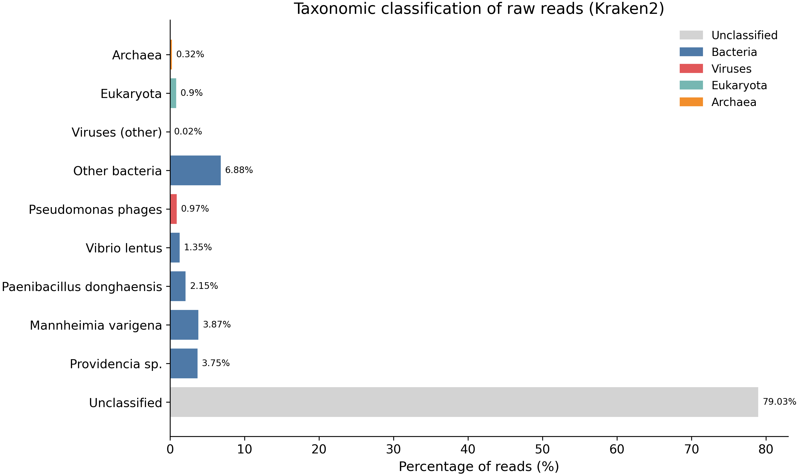

<!-- SLIDE 1: Title + Pipeline Overview -->

<!-- _class: intro -->
# Nanopore Metagenomic Assembly Pipeline

Natalia Nenasheva

**Repository:** [github.com/nvnenasheva/VEOTask](https://github.com/nvnenasheva/VEOTask)

**Sample:** `1_024_O` &nbsp;·&nbsp; No prior knowledge of sample composition &nbsp;·&nbsp; Snakemake Metagenomics

| Tool | Input | Output | Key parameters | Goal |
|---|---|---|---|---|
| NanoStat · Filtlong | reads .fastq.gz | filtered .fastq.gz | `--min_length 1000` | QC + remove short reads |
| Kraken2 | reads .fastq.gz | kraken_report .txt | k2_standard_08gb | Community composition → assembly mode |
| Flye | filtered .fastq.gz | assembly .fasta | `--nano-raw --meta` | Metagenome assembly |
| seqkit stats | assembly .fasta | stats .txt | `-a` | Contig QC: N50, GC%, length |
| Kraken2 · BLASTn | assembly .fasta | per-contig report .txt | per-sequence output | Taxonomic identity of each contig |
| Prodigal | assembly .fasta | genes .gff · proteins .faa | `-p meta` | Gene prediction |
| CheckV | assembly .fasta | quality_summary .tsv | checkv-db-v1.5 | Viral completeness & contamination |

<code>kraken_reads</code> → <code>flye</code>: taxonomic classification is an <strong>explicit dependency</strong> --> determines wether to use <code>--meta</code> assembly mode

---

<!-- SLIDE 2: QC + Taxonomy of reads -->

<!-- _class: reads-qc -->
## Step 1–2: Raw Read QC & Taxonomic Classification of Reads

### NanoStat results

| Metric | Value |
|---|---|
| Total reads | 5,251 |
| Total bases | **50.8 Mb** |
| Median read length | 6,962 bp |
| Read length N50 | **14,392 bp** |
| Max read length | 255,199 bp |
| Median quality | Q14.1 |
| Reads > Q10 | **100%** |
| Reads > Q15 | 25.2% |
| Reads > Q20 | **0.1%** |

→ Median Q14 → use <code>--nano-raw</code> (not <code>--nano-hq</code>, which requires Q20+) 
→ N50 14 kb, max 255 kb → excellent read length for long-read assembly 
→ Filter only reads &lt;1 kb — coverage already low, avoid further loss

### Kraken2 on raw reads

<strong>79% unclassified</strong> - likely organisms absent from database 
No single dominant organism among classified reads 
→ <strong>Decision: metagenomic sample</strong> 
→ Use Flye <code>--meta</code> mode for assembly

---

<!-- SLIDE 3: Assembly -->

## Step 3–4: Assembly & Assembly QC

### Flye `--meta` assembly results

| Metric | Value |
|---|---|
| Contigs assembled | **5** |
| Total length | **183 kb** |
| N50 | 41,137 bp |
| Largest contig | 58,829 bp |
| Smallest contig | 11,397 bp |
| GC content | 49.84% |
| Mean coverage (Flye) | 232× |
| Input data assembled | **~0.4%** |

<strong>Why so few contigs?</strong> 50.8 Mb distributed across many organisms → most fall below Flye's minimum coverage threshold (~10×). Only organisms with sufficient local depth were assembled. The 5 contigs that did assemble show high N50 (41 kb) and strong internal coverage (232×).

### Why `--meta` mode?

Standard assemblers assume <strong>uniform coverage</strong> across the genome. In a metagenome, each organism contributes a different fraction of reads → highly uneven coverage. Flye <code>--meta</code> is specifically designed for this: it adjusts graph construction to handle coverage variation across organisms.

### Why `--nano-raw` and not `--nano-hq`?

<code>--nano-hq</code> requires median read quality ≥ Q20. 
Our data: median Q14.1, only <strong>0.1% of reads pass Q20</strong>. 
→ Using <code>--nano-hq</code> would produce worse results. 
→ <code>--nano-raw</code> is the correct mode for R9.4.1 chemistry with standard basecalling.

---

<!-- SLIDE 4: Contig characterization -->

## Step 5–6: Contig Taxonomy, BLAST & Gene Prediction

### Kraken2 per-contig classification + BLASTn (contig_4)

| Contig | Length | Kraken2 assignment | k-mer hits | BLASTn result | Identity |
|---|---|---|---|---|---|
| contig_1 | 39,266 bp | *Vibrio* sp. J383 | strong | — | — |
| contig_2 | 11,397 bp | *Pseudomonas* phage Bf7 | strong | — | — |
| contig_3 | 41,137 bp | *Pseudomonas* phage 17A | strong | — | — |
| **contig_4** | **32,457 bp** | **Unclassified** | **5 k-mers only** | ***Vibrio* phage 1.134** (MG592505.1) | **98.5%** |
| contig_5 | 58,829 bp | *Providencia* sp. PROV188 | strong | — | — |

<strong>contig_4: only 5 k-mer hits in entire Kraken2 DB</strong> 
Organism simply absent from database → BLASTn against NCBI nt returned 46 hits, all <em>Vibrio phages</em>, E-value 0.0, top hit 98.5% identity. Distance tree places contig_4 within a well-supported Vibrio phage clade.

<strong>Prodigal gene prediction</strong> (<code>-p meta</code>) 
333 genes total across 5 contigs: 
contig_1: 66 · contig_2: 24 · contig_3: 94 · contig_4: 65 · contig_5: 84 
Low count for contig_2 consistent with its low completeness (fragment only).

---

<!-- SLIDE 5: CheckV + Discussion + Conclusions -->

## Step 7: Viral Completeness (CheckV) & Conclusions

### CheckV quality summary — all contigs viral, host_genes = 0

| Contig | Kraken2 | CheckV quality | Completeness | Viral / Total genes | Host genes |
|---|---|---|---|---|---|
| contig_1 | *Vibrio* sp. → **phage** | High | **100%** | 23 / 66 | **0** |
| contig_2 | *Pseudomonas* phage Bf7 | Low | 23.1% | 11 / 24 | **0** |
| contig_3 | *Pseudomonas* phage 17A | High | 94.1% | 41 / 94 | **0** |
| contig_4 | Unclassified → *Vibrio* phage | Medium | 79.5% | 25 / 65 | **0** |
| contig_5 | *Providencia* sp. → **phage** | High | **97.0%** | 37 / 84 | **0** |

<strong>Key discordance — Kraken2 vs CheckV:</strong> 
Kraken2 assigned contig_1 and contig_5 to <em>bacteria</em>. CheckV shows host_genes = 0 and >96% completeness for both → they are <strong>phage genomes</strong>. K-mer classifiers struggle with phage sequences due to similarity with host genomes. <strong>No single tool was sufficient.</strong>

<strong>Conclusions</strong> 
· Sample is a <strong>viral metagenome</strong> — likely marine/coastal environment 
· <strong>3/5 contigs</strong> are near-complete phage genomes (&gt;94% completeness) 
· Dominated by <em>Vibrio</em> &amp; <em>Pseudomonas</em> bacteriophages 
· Kraken2 + BLAST + CheckV all necessary for correct characterization 
· Pipeline fully reproducible: <strong>Snakemake + conda + GitHub</strong> 
· Deeper sequencing recommended for full metagenome recovery

